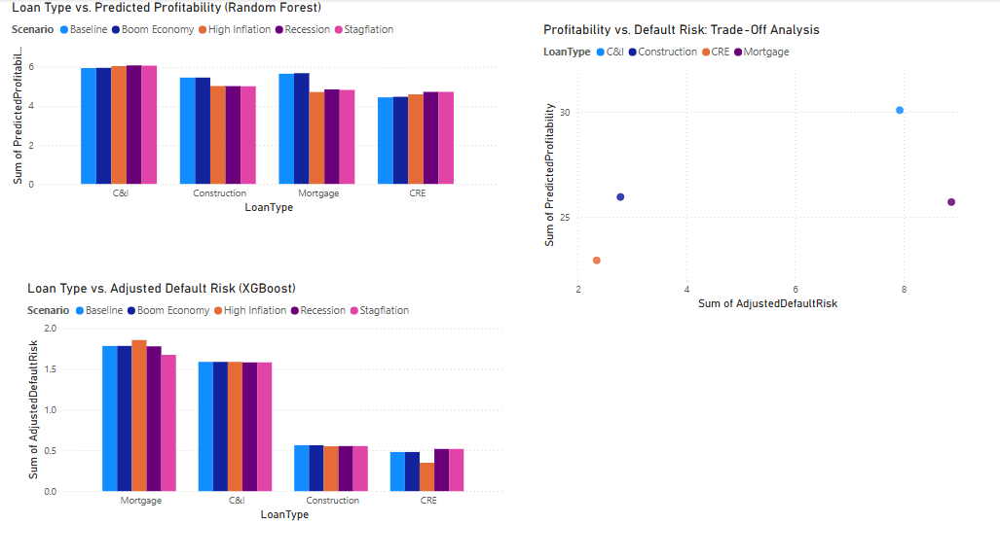
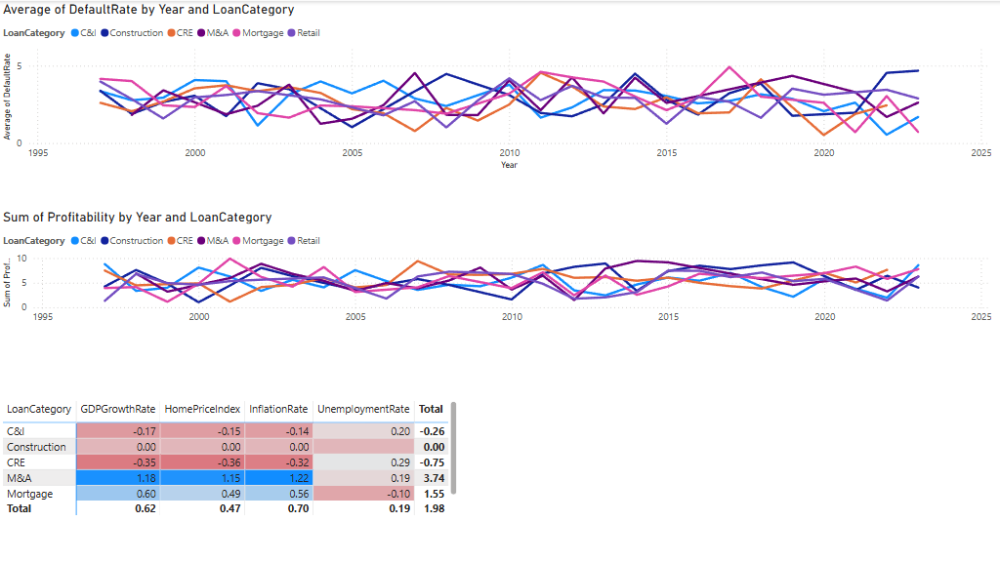
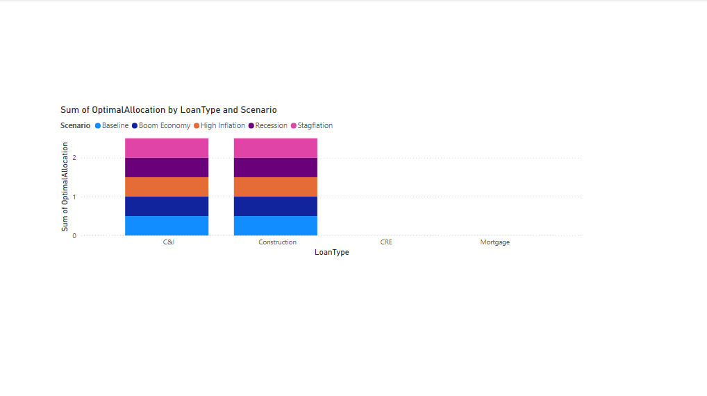

# 💼 Loan Optimization & Performance Analysis

This project analyzes and predicts the **profitability** and **default risk** of various loan types under different macroeconomic conditions using historical data.

We also optimize the **loan portfolio mix** to balance return and risk across multiple economic scenarios — visualized with Power BI.

---

## 🔍 Project Goals

- Understand how inflation, GDP, and unemployment impact loan performance.
- Train models to predict loan profitability and default risk by sector.
- Simulate economic scenarios (like recession, stagflation, boom economy).
- Recommend optimal loan allocations that maximize profit while minimizing risk.

---

## 📊 Tools & Technologies

| Area           | Tools                             |
|----------------|-----------------------------------|
| Language       | Python                            |
| ML Models      | Random Forest, Logistic Regression, XGBoost |
| Database       | SQL Server (via Pandas SQLAlchemy) |
| Optimization   | `scipy.optimize.linprog`          |
| Visualization  | Power BI                          |
| Repo Hosting   | Git & GitHub                      |

---

## 🧠 How It Works

1. **Data Collection**  
   From SQL Server:
   - `LoanPerformanceData` (core loan performance)
   - `MacroEconomicData` (macro indicators)
   - Sector-specific tables:  
     CILoanData, CRELoanData, MortgageLoanData, ConstructionLoanData, etc.

2. **Preprocessing**  
   - Merge all tables on `Date` and `LoanPerformanceID`
   - Forward-fill missing values
   - Create unified training dataset

3. **Modeling**
   - Predict Profitability: `RandomForestRegressor`
   - Predict Default Risk: `LogisticRegression` and `XGBoostClassifier`
   - Tune & evaluate performance

4. **Scenario Generation**
   - Define economic inputs (Inflation, GDP, Unemployment)
   - Feed into trained models to simulate profitability & risk by loan type

5. **Optimization**
   - Use linear programming to maximize profitability
   - Subject to constraints (e.g., overall default risk < 0.5)
   - Output: Optimal allocation per loan type per scenario

6. **Power BI Dashboard**
   - Page 1: Model output across all scenarios
   - Page 2: Macro trend correlation with profitability/default
   - Page 3: Suggested loan mix per economic environment

---

## 📁 Repository Structure

| File / Folder                    | Description |
|----------------------------------|-------------|
| `Scripts/LoanStratModel`         | Core training, modeling, preprocessing logic |
| `PowerBI/Loan_Optimization_Report.pbix` | Power BI dashboard (requires Power BI Desktop to open) |
| `databaseSchema.sql`             | Schema definitions for recreating SQL Server database |
| `*.csv`                          | Exported prediction, trend, and optimization results |
| `main.py`                        | Central execution script |
| `Readme.md`                      | This documentation |

---

## 🗄️ Database Schema

The database contains the following main tables:

- `LoanPerformanceData`
- `MacroEconomicData`
- `CILoanData`
- `CRELoanData`
- `ConstructionLoanData`
- `MortgageLoanData`
- `RetailLoanData`
- `ConsumerLoanData`
- `MALoanData`
- `RestructuringLoanData`

Each sector-specific table is linked by `LoanPerformanceID`.

A full schema with table definitions is in `databaseSchema.sql`.

---

### 🔎 Power BI Dashboard Overview

#### Page 1 – Loan Model Predictions by Scenario

#### Page 2 – Macro Trends & Correlations

#### Page 3 – Suggested Optimal Loan Mix

## ✅ What I'd Improve Next

- 🔧 Build a **Streamlit dashboard** to test real-time what-if scenarios
- 🧮 Expand optimization with risk-weighted returns and regulatory limits
- 📈 Add deeper loan-level detail (credit score, term, LTV, etc.)
- 🧪 Perform Monte Carlo simulations for **stress-testing**
- 📡 Integrate live data from APIs (e.g. FRED, BLS, Census)

---

## 🙋 About Me

Hi, I'm **Ashton Nelson** — a data analyst and developer focused on the intersection of finance, AI, and business strategy.

I built this project to showcase my technical and analytical skills using real-world loan data and economic modeling.

📧 Email: [ashtonnelson28@gmail.com](mailto:ashtonnelson28@gmail.com)  
🔗 GitHub: [github.com/anelly25](https://github.com/anelly25)

---

## ⭐ Like this project?

Give it a star ⭐ and feel free to fork or reach out if you're interested in collaborating or hiring!
